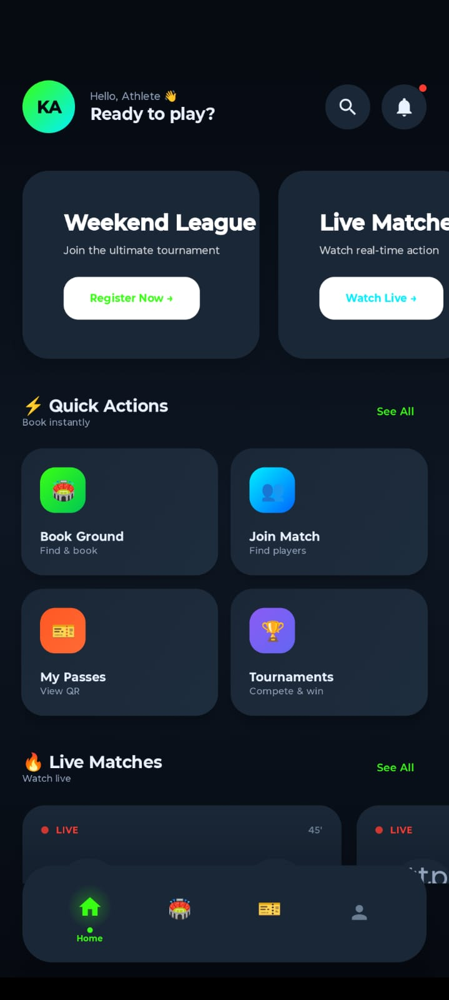
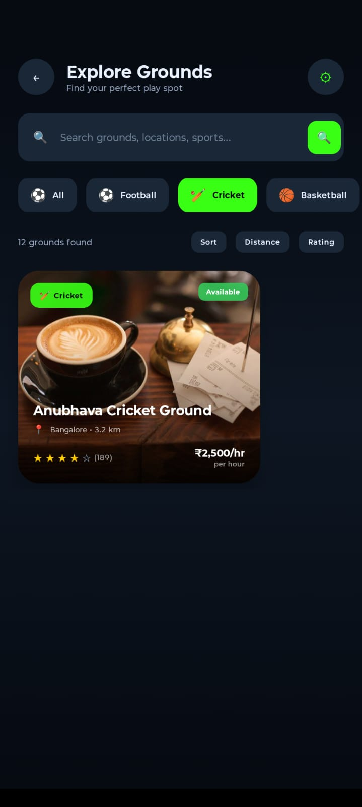
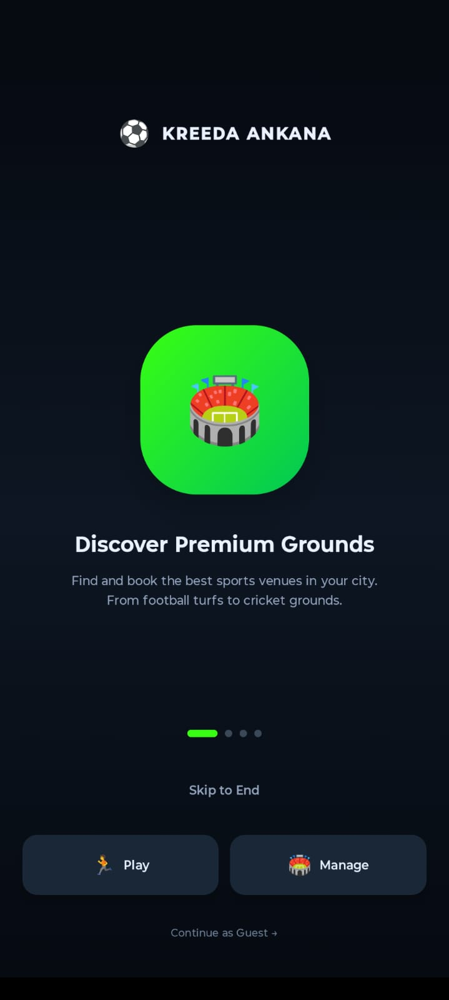
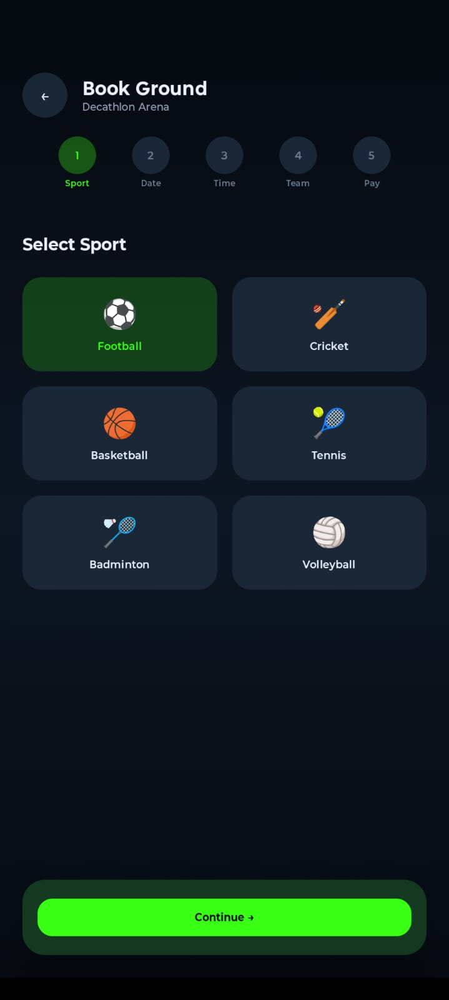
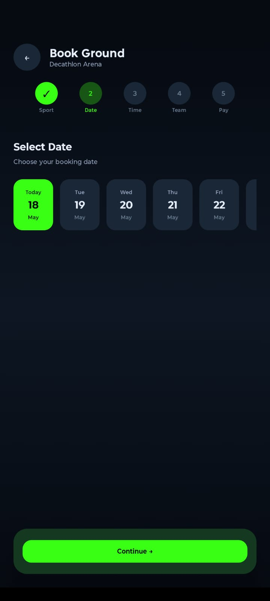
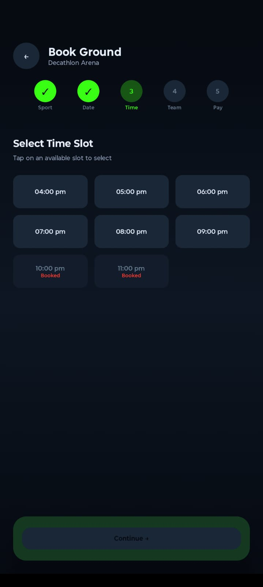
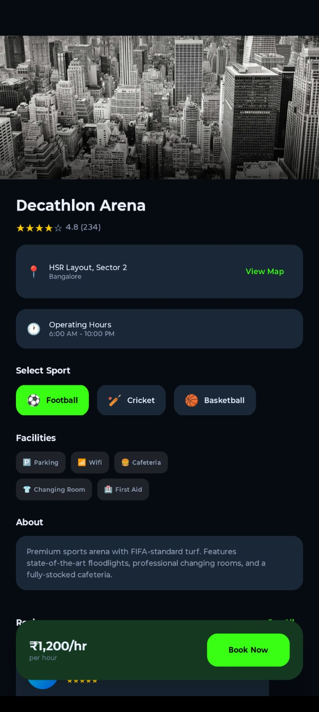

                                  ⚡ KREEDA-ANKANA ⚡
                            Sports Arena Booking & Management
                       ___________________________________________

  A comprehensive dual-role (Customer + Owner) sports ground booking and management
  Android application built entirely with Kotlin, Jetpack Compose (Material 3),
  RoomDB, Firebase, and modern Android architecture patterns.

  ___________________________________________________________

                              ✦ TABLE OF CONTENTS ✦

  1.  OVERVIEW
  2.  TECH STACK
  3.  FEATURES (CUSTOMER)
  4.  FEATURES (GROUND OWNER)
  5.  ARCHITECTURE
  6.  SCREENSHOTS
  7.  FIREBASE SETUP
  8.  BUILD & RUN
  9.  PROJECT STRUCTURE
  10. LICENSE

  ___________________________________________________________

                              ✦ 1. OVERVIEW ✦

  Kreeda-Ankana (Sanskrit: "Game Arena") is a production-grade sports infrastructure
  platform connecting players with ground owners. Built with offline-first
  principles, the app allows:

    • Customers to browse grounds, book slots, manage teams, generate QR
      entry passes, download invoices, challenge other teams, and follow
      live matches — all with real-time sync.

    • Ground Owners to manage their properties, configure slot availability,
      approve/reject bookings, run tournaments, track live scores, view
      analytics dashboards, and process payments.

  The entire app uses a dark, sporty Material 3 theme with neon accents
  (NeonGreen, ElectricBlue, Orange) and glassmorphism UI elements.

  ___________________________________________________________

                            ✦ 2. TECH STACK ✦

  LAYER          TECHNOLOGY
  ──────────────────────────────────────────────────────────
  Language       Kotlin 1.9.20
  UI             Jetpack Compose + Material 3 (BOM 2024.04.01)
  Architecture   MVVM + Repository Pattern + Clean Architecture (Owner)
  Local DB       Room (v2.6.1) with KSP — 18 entities, 15 DAOs
  Remote DB      Firebase Firestore
  Auth           Firebase Authentication (Email/Password, role-based)
  DI             Manual (ServiceLocator + ViewModelFactory)
  Navigation     Jetpack Navigation Compose
  Async          Kotlin Coroutines + Flow + StateFlow
  QR Generation  ZXing (com.google.zxing:core:3.5.2)
  QR Scanning    CameraX + ML Kit Barcode Scanning
  PDF            Android PdfDocument API
  Charts         MPAndroidChart (v3.1.0)
  Images         Coil (io.coil-kt:coil-compose:2.5.0)
  Animations     Lottie (com.airbnb.android:lottie-compose:6.3.0)
  Notifications  Firebase Cloud Messaging
  Blockchain     Hyperledger Fabric via Retrofit + OkHttp
  Sync           WorkManager (background sync worker)
  Build System   Gradle + KSP + Kotlin DSL

  Key Dependencies:
    • Room (runtime, ktx, compiler-ksp)
    • Firebase BOM 32.7.0 (auth, firestore, storage, messaging, analytics)
    • Camera2 + Camera Lifecycle + Camera View
    • Retrofit 2.9.0 + OkHttp 4.12.0 (blockchain integration)
    • Gson 2.10.1
    • Navigation Compose 2.7.7
    • Lifecycle Runtime Compose 2.7.0

  ___________________________________________________________

                        ✦ 3. FEATURES — CUSTOMER ✦

  ── AUTH & ONBOARDING ──
  • Role-based signup/login (Customer / Ground Owner)
  • Firebase Email/Password authentication
  • Onboarding flow for first-time users
  • Session management with SharedPreferences

  ── HOME & DISCOVERY ──
  • "Village Hub" dashboard with search bar
  • Live Broadcasting section — horizontal carousel of active matches
    with real-time scores
  • Sports Hub — chip-based sport filter (CRICKET, FOOTBALL,
    BADMINTON, VOLLEYBALL, TENNIS)
  • Popular Grounds — list from Room DB synced with Firestore
  • My Passes count, Rank display

  ── GROUND LISTING & DETAILS ──
  • Browse grounds filtered by sport type
  • Ground detail screen with images, amenities, pricing, rules
  • Image gallery (GroundImageEntity)
  • Favorite/bookmark grounds

  ── 5-STEP BOOKING ENGINE ──
  • Step 1 — SPORT: Select sport (Football, Cricket, Basketball,
    Tennis, Badminton, Volleyball)
  • Step 2 — DATE: Horizontal scroll of 14 available days
  • Step 3 — TIME SLOT: 2-column grid (6 AM - 10 PM, 2-hour intervals)
    with availability/past indicators
  • Step 4 — TEAM: Select existing team (filtered by sport) or
    create new team via TeamManagement
  • Step 5 — PAYMENT: Summary + "CONFIRM & PAY" button with
    simulated processing dialog
  • Progress stepper (SPORT → DATE → TIME → TEAM → PAY)
  • Double-booking prevention via Room DAO queries
  • Persistent booking via Room BookingEntity

  ── TEAM MANAGEMENT ──
  • Create teams with name, sport selector, captain name/phone
  • Dynamic member list with add/remove
  • Sport-specific player count validation:
    - Tennis / Badminton: min 1
    - Football / Cricket: min 11
    - Basketball: min 5
    - Volleyball: min 6
  • Persistent team storage (TeamEntity + TeamDao)

  ── QR ENTRY PASS ──
  • Animated QR card with NeonGreen pulsing glow
  • QR generated via ZXing QRCodeWriter from self-contained Base64
    JSON (BookingEntity.toQRString() / fromQRString())
    — no server lookup needed
  • Booking detail card (team name, captain, venue, date, time, amount)
  • Team members list
  • Share via WhatsApp, Email, SMS
  • Download Entry Pass PDF (QR code + booking details)
  • Download Invoice PDF (PdfReportGenerator + SecureInvoiceGenerator
    with SHA-256 hashing)
  • FileProvider for Android 7+ compatibility

  ── QR SCANNER (CHECK-IN) ──
  • CameraX preview + ML Kit barcode scanning
  • Decodes Base64 JSON back to BookingEntity
  • Check-in flow with status validation
  • Owner-side QR scanner for venue check-in

  ── BOOKING HISTORY & PASSES ──
  • Past bookings list with status
  • Digital passes gallery
  • Re-booking from history

  ── COMMUNITY & CHALLENGES ──
  • Challenge board for team-to-team challenges
  • Firestore real-time updates
  • Accept/decline challenges

  ── LIVE MATCHES ──
  • Watch live match scores
  • Versus screen for match comparisons
  • Real-time score updates via Firestore

  ── NOTIFICATIONS ──
  • In-app notification screen
  • Firebase Cloud Messaging (KreedaMessagingService)
  • Booking confirmation, reminders, promotional alerts

  ── PROFILE ──
  • User profile with stats tracking
  • Edit profile screen
  • My stats dashboard

  ___________________________________________________________

                        ✦ 4. FEATURES — GROUND OWNER ✦

  ── DASHBOARD ──
  • Revenue overview (Today's Revenue in Rs)
  • Today's Bookings count
  • Active Grounds count
  • Quick Actions grid (2×4):
    Grounds | Slots | Bookings | Tournaments
    Live Scores | Analytics | Payments | QR Scan
  • Recent Activity feed (last 3 bookings)
  • Animated stats cards with scale-on-press effects

  ── GROUND MANAGEMENT ──
  • List of owned grounds with status indicators
  • Ground creation/edit form:
    - Name, location, description
    - Sport type selector
    - Amenities chips (Parking, Washroom, Floodlights,
      Equipment Rental, Cafe, Changing Room)
    - Pricing fields (per hour, per session, membership)
    - Rules text area
    - Image URL input
  • OwnerGroundEntity with syncStatus tracking
  • GroundSyncRepository bridges owner→customer by copying
    Firestore grounds into Room GroundEntity

  ── SLOT MANAGEMENT ──
  • Date picker to select a day
  • 8-slot grid (6 AM - 10 PM, 2-hour intervals)
  • Block/unblock individual slots
  • Real-time Firestore sync on changes
  • Color-coded status (available/blocked/booked)

  ── BOOKING REQUESTS ──
  • List of pending booking requests
  • Customer details, ground, slot, date
  • Approve / Reject actions
  • Status tracking (pending/approved/rejected)

  ── TOURNAMENT MANAGEMENT ──
  • Create tournaments with name, date range, sport type
  • List of existing tournaments
  • Knockout bracket generation
  • Team registration management

  ── LIVE SCORING ──
  • Start/pause matches
  • Real-time score entry
  • Declare winner
  • Team vs team display
  • Firestore real-time sync for customer-side live viewing

  ── ANALYTICS ──
  • Revenue bar charts (MPAndroidChart)
  • Monthly/weekly revenue breakdowns
  • Booking trends
  • Ground-wise statistics
  • OwnerAnalyticsViewModel with loadAnalytics()

  ── PAYMENTS ──
  • Payment request listing
  • Approve/reject payments
  • UPI ID management (add/view OwnerUpiEntity)
  • PaymentEntity with status tracking
  • Revenue tracking per payment

  ── QR SCANNER ──
  • CameraX + ML Kit (same as customer)
  • Venue check-in validation
  • Owner-specific verification flow

  ___________________________________________________________

                          ✦ 5. ARCHITECTURE ✦

  ── MVVM + REPOSITORY PATTERN ──

    UI Layer (Compose Screens)
          ↓ observes
    ViewModels (StateFlow + MutableStateFlow)
          ↓ calls
    Repositories (Auth, Booking, Owner, GroundSync, ...)
          ↓ reads/writes
    Room DB (Local Source of Truth) ←→ Firestore (Cloud Sync)

  ── CLEAN ARCHITECTURE (Owner Module) ──
  The owner module follows Clean Architecture with:

    • Separate entities: OwnerGroundEntity, OwnerVerificationEntity,
      OwnerProfileEntity
    • Separate DAOs: OwnerGroundDao, TournamentDao, MatchDao,
      SlotBlockDao, RevenueDao, PaymentDao, VerificationDao
    • OwnerRepository: all owner CRUD with Firebase sync
    • 9 dedicated ViewModels:
      - OwnerDashboardViewModel
      - OwnerGroundViewModel
      - OwnerSlotViewModel
      - OwnerBookingRequestViewModel
      - OwnerTournamentViewModel
      - OwnerLiveScoreViewModel
      - OwnerAnalyticsViewModel
      - OwnerPaymentViewModel
      - OwnerQRScannerViewModel

  ── OFFLINE-FIRST SYNC ──
  1. All data writes to Room DB first (local source of truth)
  2. SyncQueueEntity tracks pending operations
  3. SyncWorker (WorkManager) runs background sync to Firestore
  4. GroundSyncRepository syncs owner-created grounds to customer
     GroundEntity for marketplace visibility
  5. Conflict resolution: latest-timestamp-wins strategy
  6. Room version 4 with fallbackToDestructiveMigration()

  ── QR SYSTEM ──
  QR codes are self-contained Base64 JSON — no server lookup required.
  BookingEntity.toQRString() serializes booking data → Base64 → QR bitmap.
  Scanner decodes QR → Base64 → deserializes → BookingEntity → check-in.

  ── DATABASE (18 ROOM ENTITIES) ──

    CUSTOMER:
      GroundEntity, GroundImageEntity, BookingEntity,
      TeamEntity, ChallengeEntity, InvoiceEntity,
      NotificationEntity, UserEntity, FavoriteEntity,
      WaitlistEntity, AnnouncementEntity

    OWNER:
      OwnerGroundEntity, SlotBlockEntity, TournamentEntity,
      MatchEntity, PaymentEntity, RevenueEntity,
      OwnerUpiEntity, OwnerProfileEntity, OwnerVerificationEntity,
      VerificationLogEntity

    SYNC:
      SyncQueueEntity

  ── NAVIGATION ──
  • Single-activity architecture (MainActivity)
  • AppNavigation composable with NavHost
  • 30+ routes (auth, customer tabs, customer screens, owner screens)
  • Bottom navigation (Home, Book, Passes, Versus, Live, Profile)
  • Role-based routing (owner login → OwnerDashboard)

  ___________________________________________________________

                           ✦ 6. SCREENSHOTS ✦

  Note: Add your screenshots to a `screenshots/` directory in the
  project root and update the paths below.

  
  *Login, Signup, and Onboarding screens with Firebase email/password auth*

  
  *"Village Hub" dashboard with live matches, sport filters, popular grounds*

  
  *Booking flow: select sport → date → time slot → team → payment*

  
  *Animated QR pass with booking details, share/download PDF invoice*

  
  *Owner command center: stats cards, quick actions grid, recent activity*

  
  *Slot grid with block/unblock, booking requests with approve/reject*

  
  *Tournament creation, live score entry, revenue analytics charts*

  ___________________________________________________________

                         ✦ 7. FIREBASE SETUP ✦

  PREREQUISITES:
    • Firebase Console account
    • Android package name: com.kreedaankana

  ── STEP 1: CREATE FIREBASE PROJECT ──
  1. Go to https://console.firebase.google.com/
  2. Click "Add Project" and name it "Kreeda-Ankana" (or your
     preferred name)
  3. Follow the setup wizard

  ── STEP 2: ADD ANDROID APP ──
  1. In Firebase Console, click Add app → Android
  2. Package name: com.kreedaankana
  3. Download google-services.json
  4. Place it at: app/google-services.json

  ── STEP 3: ENABLE SERVICES ──

    AUTHENTICATION:
      • Firebase Console → Authentication → Get Started
      • Enable Email/Password sign-in method

    FIRESTORE DATABASE:
      • Firebase Console → Firestore Database → Create Database
      • Start in test mode (update for production)
      • Collections: users, grounds, bookings, challenges,
        matches_live, tournaments, payments, notifications

    STORAGE:
      • Firebase Console → Storage → Get Started
      • Start in test mode

    CLOUD MESSAGING:
      • Firebase Console → Cloud Messaging
      • For push notifications

  ── STEP 4: ADD SHA-1 FINGERPRINT ──
  1. Firebase Console → Project Settings → General
  2. Add Android app → Enter SHA-1 certificate fingerprint
  3. Required for Google sign-in and some Firebase features

  Generate SHA-1:
    keytool -list -v -keystore ~/.android/debug.keystore \
      -alias androiddebugkey -storepass android -keypass android

  ___________________________________________________________

                          ✦ 8. BUILD & RUN ✦

  PREREQUISITES:
    • Android Studio Hedgehog (2023.1.1) or later
    • JDK 17
    • Android SDK API 34

  ── BUILD ──

    Via Android Studio:
      File → Open → Select project → Wait for Gradle sync →
      Build → Build Bundle(s)/APK(s) → Build APK(s)

    Via Command Line:
      ./gradlew assembleDebug

    APK Location:
      app/build/outputs/apk/debug/app-debug.apk

  ── INSTALL ──
    adb install app/build/outputs/apk/debug/app-debug.apk

  ── NOTE ──
  Replace app/google-services.json with your own Firebase config
  before building. The placeholder file will cause auth/firestore
  calls to fail.

  ___________________________________________________________

                       ✦ 9. PROJECT STRUCTURE ✦

  app/src/main/java/com/kreedaankana/
  │
  ├── KreedaApplication.kt              # App class, DB + repos init
  │
  ├── data/
  │   ├── local/
  │   │   ├── AppDatabase.kt            # Room DB (v4, 18 entities)
  │   │   ├── dao/                       # 15 DAO interfaces
  │   │   │   ├── BookingDao.kt
  │   │   │   ├── GroundDao.kt
  │   │   │   ├── TeamDao.kt
  │   │   │   ├── OwnerGroundDao.kt
  │   │   │   ├── TournamentDao.kt
  │   │   │   ├── MatchDao.kt
  │   │   │   ├── SlotBlockDao.kt
  │   │   │   ├── RevenueDao.kt
  │   │   │   ├── PaymentDao.kt
  │   │   │   ├── UserDao.kt
  │   │   │   ├── NotificationDao.kt
  │   │   │   ├── ChallengeDao.kt
  │   │   │   ├── InvoiceDao.kt
  │   │   │   ├── GroundImageDao.kt
  │   │   │   └── VerificationDao.kt
  │   │   ├── entity/                    # 21 Entity classes
  │   │   └── util/Converters.kt        # Room type converters
  │   ├── model/                         # UI model classes
  │   ├── repository/                    # 8 Repository classes
  │   └── blockchain/                    # Hyperledger Fabric API
  │
  ├── viewmodel/                         # 12 ViewModel classes
  │   ├── AuthViewModel.kt
  │   ├── BookingViewModel.kt
  │   ├── ChallengeViewModel.kt
  │   ├── InvoiceViewModel.kt
  │   ├── NotificationViewModel.kt
  │   ├── OwnerViewModels.kt            # 9 owner ViewModels
  │   └── ViewModelFactory.kt
  │
  ├── ui/
  │   ├── MainActivity.kt               # Single activity entry
  │   ├── MainScreen.kt                 # Bottom nav host
  │   ├── navigation/
  │   │   ├── Screen.kt                 # 30+ route definitions
  │   │   └── AppNavigation.kt          # NavHost wiring
  │   ├── theme/
  │   │   ├── Color.kt                  # Dark theme palette
  │   │   ├── Theme.kt                  # Material 3 dark scheme
  │   │   └── Type.kt                   # Typography + custom styles
  │   ├── components/                   # Reusable composables
  │   ├── splash/SplashScreen.kt
  │   ├── auth/
  │   │   ├── LoginScreen.kt
  │   │   ├── SignupScreen.kt
  │   │   └── OnboardingScreen.kt
  │   ├── customer/                     # 15 customer screens
  │   │   ├── CustomerHomeScreen.kt
  │   │   ├── GroundListingScreen.kt
  │   │   ├── GroundDetailScreen.kt
  │   │   ├── BookingScreen.kt
  │   │   ├── BookingHistoryScreen.kt
  │   │   ├── TeamManagementScreen.kt
  │   │   ├── QRGeneratorScreen.kt
  │   │   ├── QRScannerScreen.kt
  │   │   ├── QRDetailScreen.kt
  │   │   ├── PassesScreen.kt
  │   │   ├── CommunityScreen.kt
  │   │   ├── VersusScreen.kt
  │   │   ├── LiveMatchesScreen.kt
  │   │   ├── NotificationScreen.kt
  │   │   └── CustomerProfileScreen.kt
  │   └── owner/                        # 10 owner screens
  │       ├── OwnerDashboardScreen.kt
  │       ├── OwnerGroundListScreen.kt
  │       ├── OwnerGroundFormScreen.kt
  │       ├── OwnerSlotScreen.kt
  │       ├── OwnerBookingRequestScreen.kt
  │       ├── OwnerTournamentScreen.kt
  │       ├── OwnerLiveScoreScreen.kt
  │       ├── OwnerAnalyticsScreen.kt
  │       ├── OwnerPaymentScreen.kt
  │       └── OwnerQRScannerScreen.kt
  │
  ├── util/                             # Utilities
  │   ├── Constants.kt
  │   ├── Extensions.kt
  │   ├── Resource.kt                   # Sealed Result wrapper
  │   ├── SessionManager.kt
  │   ├── QRCodeGenerator.kt
  │   ├── PdfReportGenerator.kt
  │   ├── SecureInvoiceGenerator.kt
  │   └── SecurityUtils.kt
  │
  ├── service/
  │   └── KreedaMessagingService.kt     # FCM service
  │
  ├── worker/
  │   └── SyncWorker.kt                 # Background sync worker
  │
  └── di/
      └── ServiceLocator.kt             # Dependency container

  app/src/main/res/
  ├── xml/
  │   ├── file_paths.xml                # FileProvider paths
  │   ├── backup_rules.xml
  │   └── data_extraction_rules.xml
  └── values/
      └── colors.xml                    # XML color resources

  ___________________________________________________________

                            ✦ 10. LICENSE ✦

  This project is for educational and demonstration purposes.

  Built with ❤️ using Kotlin and Jetpack Compose.

  ___________________________________________________________
